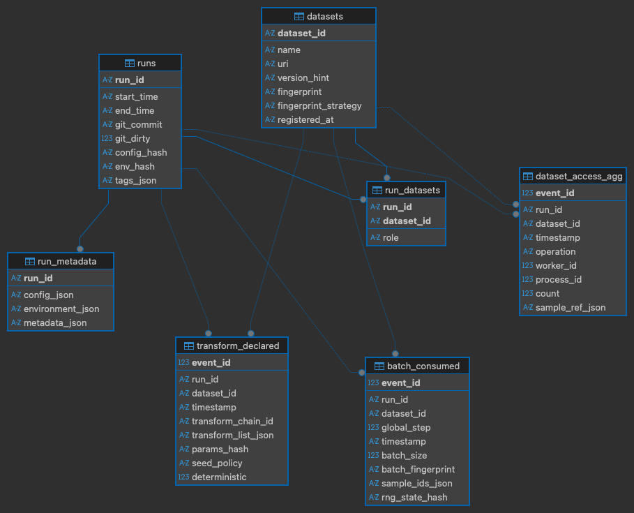

# PyPyrus — A Data Provenance Layer for Transparent and Reproducible Machine Learning Systems

---

## Project structure

```
pypyrus                
├─ docs                
├─ examples            
├─ experiments         
├─ pypyrus             
│  ├─ core               # Core abstractions (run, dataset identity, etc.)
│  ├─ instrumentation    # Library-specific instrumentation (PyTorch, TF, JAX)
│  ├─ provenance         # Event schemas + provenance semantics
│  ├─ reporting          # Query + report generation logic      
│  ├─ storage            # Store implementations (e.g. SQLite)                 
│  └─ utils              # Helper functions   
├─ scripts             
├─ tests               
├─ README.md           
└─ pyproject.toml      
```

---

# Core Abstractions

## 1. Run

A **Run** is the container that groups all provenance events for one training execution.

### Fields

* `run_id` (UUID)
* `start_time`, `end_time`
* `code_ref` (git commit hash + dirty flag)
* `config_ref` (hash of config dict/file)
* `environment_ref` (hash of environment snapshot)
* `tags` (freeform labels)

### Responsibilities

* Own a `Store`
* Attach instrumentation
* Emit `RunStartEvent` and `RunEndEvent`
* Ensure flush/close on exit (context manager)

The Run provides the **audit boundary**.

---

## 2. Dataset Identity

We must be able to state exactly **what dataset** was used, even if not explicitly declared in code.

### DatasetDescriptor

* `dataset_id` (stable internal ID)
* `name` (human readable)
* `uri` (path, S3 URL, registry reference, etc.)
* `version_hint` (optional; HF revision, DVC commit, etc.)

### DatasetFingerprint

A stable identifier of dataset state.

Strategies:

* Manifest hash (file paths + sizes + mtimes)
* Sampled content hash (chunk-based)
* Full content hash (optional strong mode)
* Registry-provided version ID

Goal:

> Detect dataset changes even if the path remains the same.

---

# Provenance Event Schema

Everything logged during a run is represented as an event.
Events are **small, append-only, and cheap**.

---

## Event Types

---

## 1️⃣ RunStartEvent

Emitted when a run begins.

### Fields

* `run_id`
* `timestamp`
* `code_ref`
* `config_ref`
* `environment_hash`
* `seed_summary`

Purpose:

* Anchor all other events
* Enable reproducibility bundle

---

## 2️⃣ RunEndEvent

Emitted when a run ends.

### Fields

* `run_id`
* `timestamp`
* `status` (success/failure)
* `event_count` (optional)

Purpose:

* Close the audit boundary
* Support lifecycle traceability

---

## 3️⃣ DatasetRegisteredEvent

Emitted when a dataset is wrapped or first accessed.

### Fields

* `run_id`
* `dataset_id`
* `name`
* `uri`
* `version_hint`
* `fingerprint`
* `fingerprint_method`

Purpose:

* Bind human dataset identity to a stable fingerprint
* Enable dataset version traceability (AI Act Art. 10)

---

## 4️⃣ TransformDeclaredEvent

Emitted when transform pipelines are defined or attached.

### Fields

* `run_id`
* `dataset_id`
* `transform_chain_id`
* `transform_list` (ordered names)
* `params_hash`
* `deterministic_flag`
* `seed_policy` (global/per-worker/per-sample)

Purpose:

* Record preprocessing and augmentation logic
* Support transparency and reproducibility
* Avoid logging per-sample transform noise

---

## 5️⃣ DatasetAccessEvent (coalesced)

Emitted at dataset boundary (e.g. `__getitem__`, `__iter__`).

### Fields

* `run_id`
* `dataset_id`
* `operation` (`getitem`, `iter`, `batch_fetch`)
* `worker_id` (optional)
* `process_id` (optional)
* `timestamp`
* `sample_ref` (index, path, or hash — optional)
* `count` (aggregation count)

Important design choice:

* Events are **coalesced**
* We do not log one event per sample unless in debug mode
* Aggregation may occur per batch or time window

Purpose:

* Track dataset usage frequency
* Detect imbalance / oversampling
* Provide dataset usage statistics

---

## 6️⃣ BatchConsumedEvent (Primary Reproducibility Event)

Emitted when a batch is received by the training loop.

This defines the **global training order**.

### Fields

* `run_id`
* `dataset_id`
* `global_step` (monotonic)
* `batch_size`
* `batch_fingerprint` (ordered hash of sample IDs)
* `sample_ids` (optional; stored in debug/full mode)
* `rng_state_hash` (optional)

Purpose:

* Compare batch streams across runs
* Detect divergence
* Enable batch-level replay
* Core for “extreme shuffling” experiments

This event answers:

> What did batch t contain in run A vs run B?

---

## 7️⃣ EnvironmentSnapshotEvent (optional)

Emitted once at run start.

### Fields

* `python_version`
* `library_versions_hash`
* `hardware_summary`
* `cuda_version` (if applicable)

Purpose:

* Strengthen reproducibility evidence
* Support documentation generation

---

# Instrumentation Layer

Instrumentation defines **where events are emitted** in the training flow.

---

## Flow Mapping

| Training Flow Step              | Event Emitted                  |
| ------------------------------- | ------------------------------ |
| `start_run()`                   | RunStartEvent                  |
| Dataset wrapped                 | DatasetRegisteredEvent         |
| Transform defined               | TransformDeclaredEvent         |
| `dataset.__getitem__()`         | DatasetAccessEvent (coalesced) |
| Batch consumed by training loop | BatchConsumedEvent             |
| `end_run()`                     | RunEndEvent                    |

---

## Instrumentor Interface

```
attach(dataset) -> dataset_proxy
```

Responsibilities:

* Intercept dataset access
* Emit DatasetAccessEvents
* Optionally propagate sample IDs
* Buffer events for coalescing

Coalescing strategies:

* Per-batch
* Per-time-window
* Per-worker aggregation

---

# Store (Local Provenance Store)

Interface:

* `append_event(event)`
* `flush()`
* `query_events(...)`

Baseline implementation:

* SQLite

Design properties:

* Append-only
* Indexed by run_id, dataset_id, event_type
* Schema versioned

---

# Query & Reporting Layer

Transforms raw provenance into meaningful outputs.

---

## Query Examples

* Which datasets were used in run X?
* How many accesses per dataset?
* What changed between run A and run B?
* At what step did batch streams diverge?
* What did batch 127 contain?

---

## Report Builder Outputs

### Dataset Traceability

* Dataset identity + fingerprint
* Split information (if available)

### Usage Summary

* Access counts
* Worker-level statistics (optional)

### Transform Chain

* Ordered preprocessing pipeline
* Parameter hashes

### Reproducibility Bundle

* Dataset fingerprint
* Code reference
* Config hash
* Seeds
* Batch stream fingerprint summary

---

# Design Principles

* Events represent **evidence**, not every micro-operation
* Logging is proportionate and configurable
* Reproducibility is evaluated at the **data stream level**
* Dataset identity and batch order are first-class citizens
* The system supports compliance evidence without enforcing policy

---

<p style="margin: 6em 0; text-align: center;">
  
  
  
  
  
  
  
  
  
  
  
  
  
  
</p>


# Entity Relationship Diagram
The following ER diagram illustrates the core tables and relationships in the PyPyrus schema. 
The db schema is subject to change as we iterate, and a few fields are still TBD (e.g. seed policy, deterministic flag, etc.) but this should give a good overview of the main entities and their connections.




<p style="margin: 6em 0; text-align: center;">
  
  
  
  
  
  
  
  
  
  
  
  
  
  
</p>

# What Do We Mean by “Reproducibility”?

Reproducibility is not one thing. There are **levels**.

## Level 0 — Output Reproducibility

> Same model weights, same metrics.

This depends on:

* GPUs / cuda kernels
* floating point nondeterminism
* hardware

PyPyrus does **not** guarantee this.

---

## Level 1 — Configuration Reproducibility

> Same code, same config, same seeds.

The `runs` table supports this:

* git commit
* config_hash
* env_hash
* seed summary

But this is kinda weak — people already log configs.

---

## Level 2 — Dataset Identity Reproducibility

> The same dataset version was used.

Pypyrus `datasets` table supports:

* dataset fingerprint
* version_hint (e.g. HF revision or DVC commit)

WandB and others can log dataset versions, but they often rely on user input.

---

## Level 3 — Data Stream Reproducibility (Core Claim)

> The model saw the same sequence of batches in the same order.

This is where the schema shines.

From `batch_consumed`:

* `global_step`
* `batch_fingerprint`

You can:

* Compare runs A and B step-by-step
* Compute match rate
* Find first divergence step
* Detect shuffling differences
* Detect dropped batches (e.g. DatasetAccessEvent shows fetch but no corresponding BatchConsumedEvent)

This is **reproducibility of the training data stream**.

This is a strong, measurable claim that goes beyond config logging. It’s about the actual data seen by the model.

---

## Level 4 — Exact Batch Reconstruction
(Optional, We could maybe implement this and somehow compress the sample_ids if it doesn’t blow up storage)

If we store `sample_ids`:

We can:

* Show exactly which samples were in batch 127
* Replay the exact data stream (a task for the future perchance)
* Debug divergence precisely

That’s full data-stream replay capability!

---

# So To What Extent Can We Show Reproducibility?

With your current schema:

### We can prove:

* Same dataset version
* Same transform pipeline declaration
* Same batch sequence
* Same batch grouping
* Same divergence point

We cannot prove or wont attempt at least to prove:

* Same floating point execution
* Same internal augmentation randomness
* Same gradient values

---

# How we can demonstrate this:

In experiments:

1. Run training twice under fixed seed.
2. Compare:

   * dataset fingerprint
   * transform params_hash
   * batch_fingerprint per step
3. Show 100% match.

Then:

4. Introduce "extreme" shuffling.
5. Show:

   * Divergence at step 37.
   * Different batch_fingerprint.
   * Possibly different sample usage distribution.

This becomes measurable evidence.


We are not claiming:

> PyPyrus guarantees identical model weights.

But we are claiming:

> PyPyrus enables reproducibility at the data-stream level by making the training data sequence observable, comparable, and "reconstructable" at some point (seems tedious to implement exact batch replay, but thats another project perchance).

That is precise, defensible, and aligned with AI Act traceability requirements.

---

