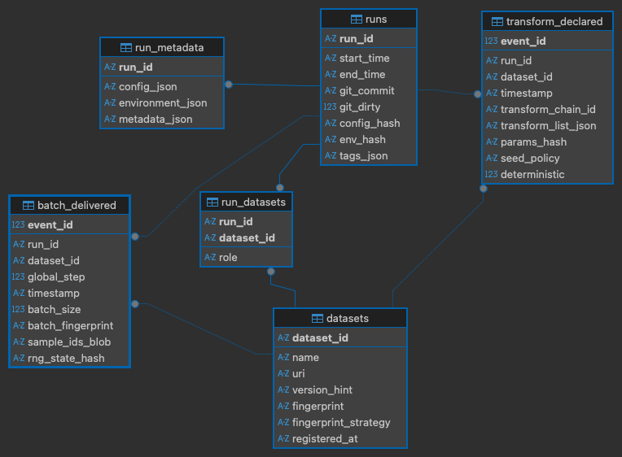

# PyPyrus Internal Working Notes

This document is a live internal design and planning document used while
implementing PyPyrus.

It is not part of the user-facing SDK/CLI documentation.

---

# PyPyrus — A Data Provenance Layer for Transparent and Reproducible Machine Learning Systems
### Focus on single machine pytorch training pipelines for now, but design with future extensibility in mind.

---

## Project structure

```
pypyrus                                              
├─ core                                      
│  ├─ __init__.py                            
│  ├─ attach.py                              
│  ├─ config.py                              
│  ├─ dataset_identity.py                    
│  ├─ run.py                                 
│  └─ transform_identity.py                  
├─ instrumentation                                    
│  ├─ __init__.py                            
│  ├─ collate.py                             
│  ├─ dataloader.py                          
│  └─ dataset.py                             
├─ provenance                                       
│  ├─ __init__.py                            
│  ├─ events.py                              
│  ├─ fingerprints.py                        
│  └─ semantics.py                           
├─ reporting                                           
│  ├─ __init__.py                            
│  ├─ compare.py                             
│  └─ queries.py                             
├─ storage                                              
│  ├─ schema                                 
│  │  ├─ 01_runs.sql                         
│  │  ├─ 02_datasets.sql                     
│  │  ├─ 03_run_datasets.sql                 
│  │  ├─ 04_batch_delivered.sql              
│  │  ├─ 05_transform_declared.sql           
│  │  ├─ 06_dataset_access_agg.sql           
│  │  └─ 07_run_metadata.sql                 
│  ├─ __init__.py                            
│  ├─ migrate.py                             
│  ├─ sqlite_store.py                        
│  └─ store.py                               
└─ __init__.py                               
  
```

---

# Core Abstractions

## 1. Run

A **Run** is the container that groups all provenance events for one training execution.

### Fields

* `run_id` (UUID)
* `start_time`, `end_time`
* `code_ref` (git commit hash + dirty flag)
* `config_ref` (hash of config dict/file)
* `environment_ref` (hash of environment snapshot)
* `tags` (freeform labels)

### Responsibilities

* Own a `Store`
* Attach instrumentation
* Emit `RunStartEvent` and `RunEndEvent`
* Ensure flush/close on exit (context manager)

The Run provides the **audit boundary**.

---

## 2. Dataset Identity

We must be able to state exactly **what dataset** was used, even if not explicitly declared in code.

### DatasetDescriptor

* `dataset_id` (stable internal ID)
* `name` (human readable)
* `uri` (path, S3 URL, registry reference, etc.)
* `version_hint` (optional; HF revision, DVC commit, etc.)

### DatasetFingerprint

A stable identifier of dataset state.

Strategies:

* Manifest hash (file paths + sizes + mtimes)
* Sampled content hash (chunk-based)
* Full content hash (optional strong mode)
* Registry-provided version ID

Goal:

> Detect dataset changes even if the path remains the same.

---

# Provenance Event Schema

Everything logged during a run is represented as an event.
Events are **small, append-only, and cheap**.

---

## Event Types

---

## 1️⃣ RunStartEvent

Emitted when a run begins.

### Fields

* `run_id`
* `timestamp`
* `code_ref`
* `config_ref`
* `environment_hash`
* `seed_summary`

Purpose:

* Anchor all other events
* Enable reproducibility bundle

---

## 2️⃣ RunEndEvent

Emitted when a run ends.

### Fields

* `run_id`
* `timestamp`
* `status` (success/failure)
* `event_count` (optional)

Purpose:

* Close the audit boundary
* Support lifecycle traceability

---

## 3️⃣ DatasetRegisteredEvent

Emitted when a dataset is wrapped or first accessed.

### Fields

* `run_id`
* `dataset_id`
* `name`
* `uri`
* `version_hint`
* `fingerprint`
* `fingerprint_method`

Purpose:

* Bind human dataset identity to a stable fingerprint
* Enable dataset version traceability (AI Act Art. 10)

---

## 4️⃣ TransformDeclaredEvent

Emitted when transform pipelines are defined or attached.

### Fields

* `run_id`
* `dataset_id`

* `transform_list` (ordered names)
* `params_hash`
* `deterministic_flag`
* `seed_policy` (global/per-worker/per-sample)

Purpose:

* Record preprocessing and augmentation logic
* Support transparency and reproducibility
* Avoid logging per-sample transform noise

---

<!-- ## 5️⃣ DatasetAccessEvent (coalesced)

Emitted at dataset boundary (e.g. `__getitem__`, `__iter__`).

### Fields

* `run_id`
* `dataset_id`
* `operation` (`getitem`, `iter`, `batch_fetch`)
* `worker_id` (optional)
* `process_id` (optional)
* `timestamp`
* `sample_ref` (index, path, or hash — optional)
* `count` (aggregation count)

Important design choice:

* Events are **coalesced** 
* Aggregation may occur per batch or time window -->

Purpose:

* Track dataset usage frequency
* Detect imbalance / oversampling
* Provide dataset usage statistics

---

## 6️⃣ BatchDeliveredEvent (Primary Reproducibility Event)

Emitted when a batch is received by the training loop.

This defines the **global training order**.

### Fields

* `run_id`
* `dataset_id`
* `global_step` (monotonic)
* `batch_size`
* `batch_fingerprint` (ordered hash of sample IDs)
* `sample_ids` (optional; stored in debug/full mode)

Purpose:

* Compare batch streams across runs
* Detect divergence
* Reconstruct training order under shuffling
* Enable data-stream reproducibility experiments

This event answers:

> What did batch t contain in run A vs run B?

### Optional Strict version — BatchConsumedEvent (Step Boundary)

This is emitted inside a wrapped training step function, immediately before or after the model forward pass.

This mode requires minimal additional integration (e.g., wrapping a `train_step` function).

In strict version:

* `global_step` aligns with training steps
* Skipped batches are not logged
* Logging reflects actual computation entry

---

## 7️⃣ EnvironmentSnapshotEvent (optional)

Emitted once at run start.

### Fields

* `python_version`
* `library_versions_hash`
* `hardware_summary`
* `cuda_version` (if applicable)

Purpose:

* Strengthen reproducibility evidence
* Support documentation generation

---

# Instrumentation Layer

Instrumentation defines **where events are emitted** in the training flow.

---

## Flow Mapping

| Training Flow Step                       | Event Emitted          |
| ---------------------------------------- | ---------------------- |
| `start_run()`                            | RunStartEvent          |
| Dataset registered / wrapped             | DatasetRegisteredEvent |
| Transform introspected at registration   | TransformDeclaredEvent |
| DataLoader yields batch to training loop | BatchDeliveredEvent    |
| `end_run()`                              | RunEndEvent            |

PyPyrus captures provenance at the **DataLoader → training loop handoff**, avoiding intrusive modification of model or optimizer logic.

### Optional Strict Flow (Step Boundary Mode)
| Training Flow Step     | Event Emitted          |
| ---------------------- | ---------------------- |
| `start_run()`          | RunStartEvent          |
| Dataset registered     | DatasetRegisteredEvent |
| Transform introspected | TransformDeclaredEvent |
| Batch yielded          | (IDs attached only)    |
| Training step executed | BatchConsumedEvent     |
| `end_run()`            | RunEndEvent            |

In this mode:

* DataLoader wrapper propagates sample IDs (BatchDeliveredEvent)
* Step wrapper emits the event (BatchConsumedEvent)
---

## Instrumentor Interface

```
attach_dataloader(loader) -> loader_proxy
```

Responsibilities:

* Wrap DataLoader iterator
* Ensure sample IDs are propagated per batch
* Compute ordered batch fingerprint
* Emit BatchDeliveredEvent
* Buffer events for efficient storage writes

Optional batch-consumed instrumentation:

```
wrap_step(train_step) -> instrumented_step
```

Responsibilities:

* Emit BatchConsumedEvent at computation boundary
* Maintain accurate global_step alignment


---

# Store (Local Provenance Store)

Interface:

* `append_event(event)`
* `flush()`
* `query_events(...)`

Baseline implementation:

* SQLite

Design properties:

* Append-only
* Indexed by run_id, dataset_id, event_type
* Schema versioned

---

# Query & Reporting Layer

Transforms raw provenance into meaningful outputs.

---
## Query Examples

* Which datasets were used in run X?
* What was the delivered batch sequence?
* At what step did batch streams diverge?
* What did batch 127 contain?
* What is the match rate between run A and B?

---

## Report Builder Outputs

### Dataset Traceability

* Dataset identity + fingerprint
* Split information (if available)

### Data Stream Summary

* Total batches delivered
* Match rate across runs
* First divergence step
* Batch size consistency

### Transform Chain

* Ordered preprocessing pipeline
* Parameter hashes

### Reproducibility Bundle

* Dataset fingerprint
* Code reference
* Config hash
* Seeds
* Batch stream fingerprint summary

---

# Design Principles

* Events represent **evidence**, not every micro-operation
* Logging is proportionate and configurable
* Reproducibility is evaluated at the **data stream level**
* Dataset identity and batch order are first-class citizens
* The system supports compliance evidence without enforcing policy

---

<p style="margin: 6em 0; text-align: center;">
  
  
  
  
  
  
  
  
  
  
  
  
  
  
</p>


# Entity Relationship Diagram
The following ER diagram illustrates the core tables and relationships in the PyPyrus schema. 
The db schema is subject to change as we iterate, and a few fields are still TBD (e.g. seed policy, deterministic flag, etc.) but this should give a good overview of the main entities and their connections.




<p style="margin: 6em 0; text-align: center;">
  
  
  
  
  
  
  
  
  
  
  
  
  
  
</p>

# What Do We Mean by “Reproducibility”?

Reproducibility is not one thing. There are **levels**.

## Level 0 — Output Reproducibility

> Same model weights, same metrics.

This depends on:

* GPUs / cuda kernels
* floating point nondeterminism
* hardware

PyPyrus does **not** guarantee this.

---

## Level 1 — Configuration Reproducibility

> Same code, same config, same seeds.

The `runs` table supports this:

* git commit
* config_hash
* env_hash
* seed summary

But this is kinda weak — people already log configs.

---

## Level 2 — Dataset Identity Reproducibility

> The same dataset version was used.

Pypyrus `datasets` table supports:

* dataset fingerprint
* version_hint (e.g. HF revision or DVC commit)

WandB and others can log dataset versions, but they often rely on user input.

---

## Level 3 — Data Stream Reproducibility (Core Claim)

> The model saw the same sequence of batches in the same order.

This is where the schema shines.

From `batch_delivered` (or `batch_consumed` in strict version):

* `global_step`
* `batch_fingerprint`

You can:

* Compare runs A and B step-by-step
* Compute match rate
* Find first divergence step
* Detect shuffling differences
* Detect dropped batches (missing steps)

This is **reproducibility of the training data stream**.

This is a strong, measurable claim that goes beyond config logging. It’s about the actual data seen by the model.

---

## Level 4 — Exact Batch Reconstruction
(Optional, We could maybe implement this and somehow compress the sample_ids if it doesn’t blow up storage)

If we store `sample_ids`:

We can:

* Show exactly which samples were in batch 127
* Replay the exact data stream (a task for the future perchance)
* Debug divergence precisely

That’s full data-stream replay capability!

---

# So To What Extent Can We Show Reproducibility?

With your current schema:

### We can prove:

* Same dataset version
* Same transform pipeline declaration
* Same batch sequence
* Same batch grouping
* Same divergence point

We cannot prove or wont attempt at least to prove:

* Same floating point execution
* Same internal augmentation randomness
* Same gradient values

---

# How we can demonstrate this:

In experiments:

1. Run training twice under fixed seed.
2. Compare:

   * dataset fingerprint
   * transform params_hash
   * batch_fingerprint per step
3. Show 100% match.

Then:

4. Introduce "extreme" shuffling.
5. Show:

   * Divergence at step 37.
   * Different batch_fingerprint.
   * Possibly different sample usage distribution.

This becomes measurable evidence.


We are not claiming:

> PyPyrus guarantees identical model weights.

But we are claiming:

> PyPyrus enables reproducibility at the data-stream level by making the training data sequence observable, comparable, and "reconstructable" at some point (seems tedious to implement exact batch replay, but thats another project perchance).

That is precise, defensible, and aligned with AI Act traceability requirements.

PyPyrus defines dataset-level reproducibility at the data stream boundary rather than at raw dataset access or internal model computation. This avoids logging execution-layer artifacts (e.g., worker scheduling or prefetching) and instead records the exact sequence of samples delivered to training.

---

<p style="margin: 6em 0; text-align: center;">
  
  
  
  
  
  
  
  
  
  
  
  
  
  
</p>

# Instrumentation Architecture

PyPyrus instruments the training pipeline at two boundaries:

1. **Dataset boundary** — inject stable sample identifiers
2. **DataLoader boundary** — observe and log the delivered batch stream

Instrumentation is part of the `instrumentation/` module:

```
pypyrus/
  instrumentation/
    dataset.py      # Inject sample IDs
    dataloader.py   # Observe batch stream + emit events
    collate.py      # Preserve IDs through collation (helper)
```

---

## Dataset Wrapper (`dataset.py`)

**Boundary:** `dataset.__getitem__`

The dataset wrapper injects a stable `sample_id` into every returned sample.

Responsibilities:

* Attach deterministic `sample_id` (default: dataset index)
* Preserve original dataset behavior
* Perform no logging

This ensures identity propagates through batching and multiprocessing.

---

## DataLoader Wrapper (`dataloader.py`)

**Boundary:** DataLoader iterator (`for batch in loader:`)

The DataLoader wrapper:

* Extracts ordered `sample_ids` per batch
* Computes a batch fingerprint
* Emits `BatchDeliveredEvent`
* Buffers events for efficient storage

A `BatchDeliveredEvent` means:

> This batch was delivered from the DataLoader to the training loop.

This defines the observable **data stream boundary** used for reproducibility analysis.

---

## Collate Handling (`collate.py`)

Because batches may have arbitrary structure (tuples, dicts, nested objects, custom `collate_fn`), PyPyrus optionally wraps the `collate_fn` to ensure `sample_id`s are preserved during collation.

The original batch structure is preserved for user code.

---

## Public API

Instrumentation requires a single call:

```python
with pypyrus.Run() as run:
    loader = pypyrus.attach(loader, run, role="train")
```

Internally this:

1. Wraps the dataset
2. Wraps the DataLoader
3. Enables batch-level provenance logging

No changes to model or optimizer code are required in default mode.

---

## Next Steps v2

This is the project state after the current MVP pass:

* Run lifecycle exists
* SQLite persistence exists
* Dataset identity + fingerprinting exists
* Transform declaration capture exists
* Batch delivery provenance exists
* Run comparison exists
* A query/reporting layer exists
* A first CLI exists
* Basic integration and smoke tests exist
* DataLoader cloning has now been hardened for custom collate, custom batch samplers, seeded shuffle, and multi-worker loading

That means the project is no longer in "build the core primitives" mode.
The next phase should focus on **stabilizing the MVP boundary**, **closing the biggest correctness gaps**, and **making the tool usable for experiments and demos**.

### 1. Fix the remaining batch identity model gap

Current risk:

* `BatchDeliveredEvent` is keyed by `run_id + dataset_id + global_step`
* this is fragile when the same logical dataset is attached multiple times in one run under different roles or loaders

Next step:

* add a stable loader identity to batch-level provenance
* make role/loader identity explicit in `BatchDeliveredEvent` and the schema
* update comparison/query code to use this identity rather than inferring everything from dataset ID alone

This is the most important correctness task left in the current architecture.

### 2. Add a real configuration surface (skip for now, not sure if this is actually needed for the MVP)

The project now has enough behavior toggles that an explicit config object is justified.

Add configuration for:

* store sample IDs or not
* compression on/off
* strict clone mode / clone validation policy
* default DB path
* future debug vs compact provenance mode

Goal:

* move operational choices out of ad hoc code paths and examples

### 3. Strengthen run metadata for actual reproducibility claims

The run abstraction should capture more of the "why this run is reproducible" story.

Next step:

* standardize code reference capture
* standardize config hashing / config snapshot input
* standardize seed summary collection
* expose this in both the stored schema and CLI output

This makes the system stronger for thesis experiments and reporting.

Currently captured:
* code_ref (git commit + dirty flag)  
* environment_ref (python version + library versions hash + hardware summary hash + cuda version)

Not yet captured but could be (not sure if we need all of these for the MVP, but they are worth considering):
* config_ref (hash of config dict or file). Since we dont have an config to control pypyrus behavior yet, this is more of a "user config" reference that could be added to the Run metadata. 
* seed_summary (summary of all relevant seeds, e.g. global seed, worker seeds, etc.). This is important for reproducibility claims, but we cant capture this reilibly just by inspecting the process. Would have to be captured via explicit user input like config yaml files in WandB or Hydra.

### 4. Expand reporting and CLI into an experiment workflow

The CLI now exists, but it is still an MVP inspection surface.

Concrete MVP plan:

The goal is not to add many commands. The goal is to make the existing commands
good enough that they become the default workflow for inspecting provenance runs
during experiments and demos.

Keep the command surface small:

* `pypyrus runs list`
* `pypyrus runs show <run_id>`
* `pypyrus compare <run_a> <run_b>`
* `pypyrus batches show <run_id> --step N`

What each command should do well:

#### `runs list`

This should answer:

> What runs do I have, and which ones are worth inspecting?

Minimum improvements:

* show enough summary data to scan runs without opening each one
* include basic scale indicators such as status, start/end, batch count, and roles present
* include lightweight identity hints such as dataset count and maybe dataset names when concise
* keep the default table compact and readable for terminal use

Optional later:

* compact vs detailed table modes
* sorting / limiting / status filters if the run list grows

#### `runs show`

This should answer:

> What exactly happened in this run?

Minimum improvements:

* show run-level provenance metadata that already exists or is likely to exist soon:
  `code_ref`, `config_ref`, environment summary, and any available seed/config notes
* show counts that matter for debugging:
  datasets, loaders, transforms, batches, and batch counts by role
* show dataset identity in a more useful way:
  role, name, dataset_id, fingerprint, fingerprint method
* show registered loaders explicitly so multi-loader runs are understandable
* keep the output readable in text mode and complete in `--json`

#### `compare`

This should answer:

> Do these two runs match, and if not, why not?

Minimum improvements:

* keep comparison role-aware by default
* clearly separate dataset identity mismatch from batch-stream mismatch
* show the first divergence in a way that is useful for diagnosis:
  role, loader_id, global step, global sequence, batch fingerprint, sample IDs if present
* report whether the mismatch is:
  dataset mismatch, batch count mismatch, or batch fingerprint divergence
* make the output useful for thesis/demo evidence, not just raw debugging

Optional later:

* role filter so users can compare only `train` or only `val`
* compact vs detailed compare output

#### `batches show`

This should answer:

> Show me the exact batch at the point I care about.

Minimum improvements:

* preserve explicit disambiguation for multi-loader runs via `--role`, `--dataset-id`, or `--loader-id`
* keep sample IDs optional so the command stays usable in compact provenance modes
* show enough batch identity to connect it back to compare output

#### `samples find` (scoped MVP extension)

This should answer:

> Was this specific sample used in a run?

MVP scope:

* support direct lookup by stored `sample_id`
* support filepath lookup via `--dataset-path` + file path for file-backed map-style datasets
* require dataset fingerprint match before trusting filepath-based reverse lookup
* return a practical answer rather than raw rows:
  found yes/no, occurrence count, first occurrence, and relevant roles/loaders/steps

Important limitation:

* direct `sample_id` lookup is the generic feature
* filepath lookup is only a convenience layer for dataset types where a file path can be mapped back to the stored sample identity
* this should not pretend to support arbitrary custom datasets in the MVP

#### Design rule for the MVP CLI

The CLI should let a user answer these five questions without writing Python or SQL:

1. What runs exist?
2. What datasets / loaders / transforms were involved in a run?
3. What code/environment context was attached to that run?
4. Do two runs match at the dataset and batch-stream level?
5. Where is the first concrete point of divergence?

Immediate implementation order:

1. improve `runs show` so it exposes the full run story
2. improve `runs list` so it is useful as the default entry point
3. improve `compare` so divergence diagnosis is explicit and easy to read
4. add role filtering and compact/detailed output only if the first three are solid

Goal:

* let the CLI become the default way to inspect runs, not just a thin demo
* keep the interface small, stable, and defensible for the MVP

### 5. Add focused tests around the non-covered seams

The current tests are good enough to build on, but not yet broad enough to defend the whole project.

Next test additions:

* fingerprint helper unit tests
* transform declaration unit tests
* reporting query tests
* compare-run regression tests
* CLI json contract tests
* explicit regression test for "same dataset attached twice in one run"

Keep prioritizing integration tests first when they validate a real contract boundary.

### 6. Create experiment scripts that support thesis evidence directly

At this point, experiments are more valuable than adding another internal abstraction.

Add small repeatable scripts for:

* same seed, same config
* changed shuffle only
* changed transform only
* changed dataset contents only
* changed loader role / multi-loader run

Each script should produce a clear claim that PyPyrus can detect.

### 7. Tighten packaging and developer ergonomics

Before wider use, clean up the developer surface:

* make editable install + CLI flow explicit
* clean up stale docs and examples
* document the supported DataLoader envelope clearly
* add a simple "known limitations" section

This is boring work, but it reduces confusion and saves time later.

### 8. Optional next-phase research features

These are useful, but they should not distract from the MVP hardening phase:

* strict step-boundary / batch-consumed mode
* richer transform provenance
* replay or advanced reconstruction
* non-PyTorch backends
* remote / multi-machine storage backends

## If you feel aimless, do this next

Do these four in order:

1. Fix the batch identity model so multiple loaders on the same dataset are first-class
2. Add a real config object and wire it into `Run` / `attach`
3. Improve the CLI/reporting output so runs and comparisons are genuinely usable
4. Add experiment scripts that demonstrate the core claims end-to-end

That sequence keeps you on the MVP path while turning the current code into something defensible and demoable.
